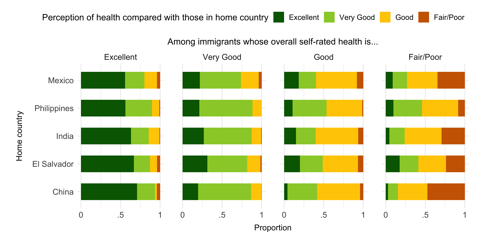

# U.S. Immigrants Have Highly Heterogeneous Perceptions of How Selected They Are

## Introduction
Here we provide the data and code required for replicating the findings presented in the data visualization that illustrated heterogeneous health reports in comparison to the country of origin by self-reported health status for top-five immigrant sending countries included in the New Immigrant Survey (NIS). 

## Data 
### Data are included in the in the New Immigrant Survey - Sections [A (Demographic)](https://nis.princeton.edu/downloads/codebook/Adult/A-adult-codebook.pdf) and [D (Health)](https://nis.princeton.edu/downloads/codebook/Adult/D-adult-codebook.pdf)

Data can be accessed through: https://nis.princeton.edu/

## Process 

* Respondents are selected from top-sending countries (A9Amo).
* We stratify by Self-Reported Health (d1).
* We show the distribution of Health compared to those in home country (d112).
* Sampling weights were applied to produce nationally representative estimates (niswgtsamp1).

## Code
The [code](Visualization_ImmigrantHealth_Code_06022022.R) included in this repository can be used to replicate our data visualization. Data should be requested from the NIS Repository (as described above). 

## Correspondence
For any issue with the functionality of this script please [create an issue](https://github.com/alexisrsantos/immigrant_selection/issues).

## License
The data collected and presented is licensed under the [Creative Commons Attribution 3.0 license](http://creativecommons.org/licenses/by/3.0/us/deed.en_US), and the underlying code used to format, analyze and display that content is licensed under the [MIT license](http://opensource.org/licenses/mit-license.php).
